# Project GeoGuardians

GeoGuardians is a mobile application developed to monitor and manage forest fires and water precipitation in Brazil. This innovative tool serves as a critical resource for both government agencies and concerned citizens, offering real-time data and insights to inform critical decisions related to wildfire prevention and response.

With a user-friendly interface, GeoGuardians provides up-to-date information on forest fire incidents, their causes and environmental and social impacts. Additionally, it provides crucial data on precipitation patterns, helping to assess drought conditions and manage water resources.

GeoGuardians extends its usefulness beyond merely providing data, offering guidance on forest fire prevention and firefighting strategies. Encourages citizen involvement by allowing individuals to report incidents, contributing to a collaborative effort in safeguarding natural landscapes.

By leveraging satellite data, weather stations and citizen reports, GeoGuardians integrates multiple data sources, ensuring accuracy and comprehensiveness. Additionally, it promotes collaboration with relevant government agencies, consolidating its role as a critical tool in wildfire response infrastructure.

This project highlights the paramount importance of environmental conservation and sustainability in the world, empowering stakeholders to make informed choices that protect both the environment and the country's economy. As GeoGuardians continues to evolve, it promises a safer, more resilient future for the world in the face of wildfires and changing precipitation patterns.

## Project Details

The main goal of the project was to build an application for the whole community to act against the wildfires. In the app there are 3 different profiles:

The base profile is the Civilian, you can have the following functions:

Fire Monitoring: The application provides information on the location, size and intensity of forest fires. It works by gathering all the data from API’s and showing it to the user in a simplified way, with Heatmap and Marker visuals in the format of an interactive map.

Report fires: While you’re witnessing a fire you can report to the authorities. In this code there will be a validation system that will only alert the fire house if three or more people report the same fire, to prevent ill intentioned people.

Statistics: It has the information quantified about the precipitation and fires in different regions of Brazil.

Alerts: They will receive a notification when a fire is confirmed near their location. The data is provided by the satellites and also by people’s reports.

The second type of profile is the Farmer, they can have the same functions as the civilians with a twist in the alert one, instead of being notified when a fire is around their location they are notified when it’s near their propriety.

And they also have a special functionality:

Thermal Cameras: They will be able to order thermal cameras monitored by an AI that will alert them when a fire starts so they can act fast and minimize the demage.

The third profile is the Fire Station, we want all of them to register in our platform with the help of the goverment. They will also have acess to different functionatilies:

Fire Station Alerts: If you are entering the app through a Fire Station profile, you will be notified when there is a fire next to your station. Your station will be the closest to the fire notified.

Location: We will also provide the coordinates in the alerts. Once we have the fire stations registered we willl know what type of location system they use and provide the best solution.

In summary, we benefit the community by providing information that make posssible to act in an efficient and fast way. We want to achieve fast response in order to minimize the amount of fires happening in the world.

In the development process we used:

- Visual Studio Code for Coding

- Glide Apps, Figma for the App Prototype

- Trello for Organizing Objectives

- Google Meet and Discord for Team Communication

As the main programming language we have used Python. Here are the main libraries used:

Streamlit
Streamlit_folium
Folium
Pandas
Datetime
Geopandas
Plotly

## Screenshots

    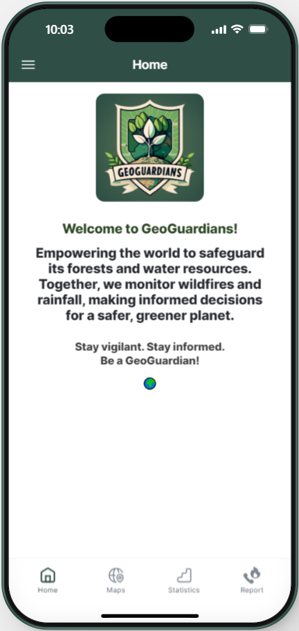
    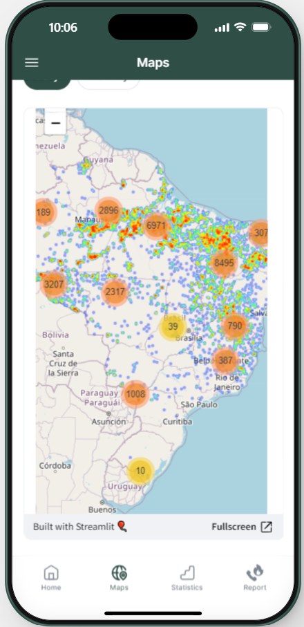
    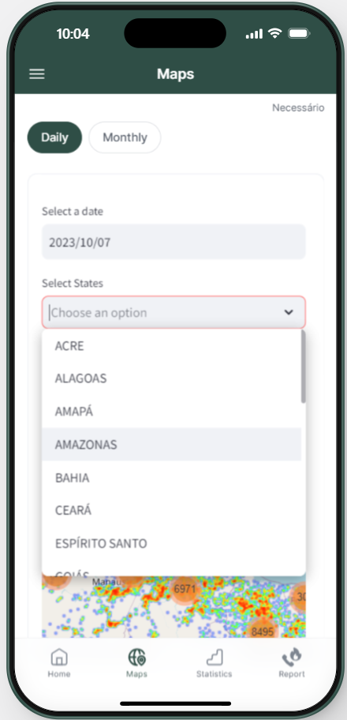
    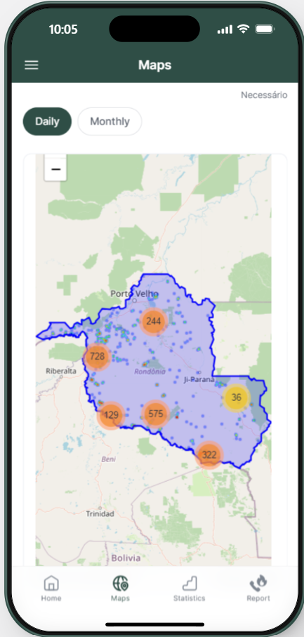
    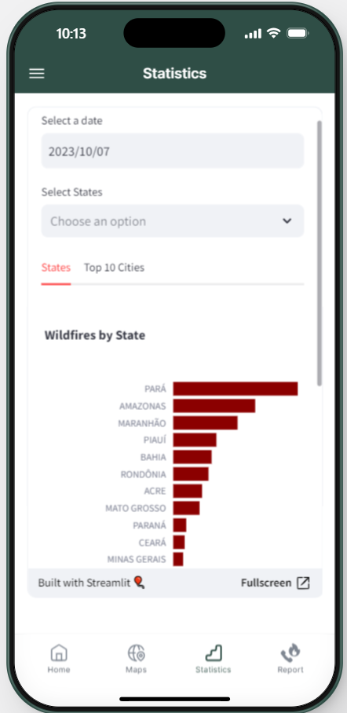
    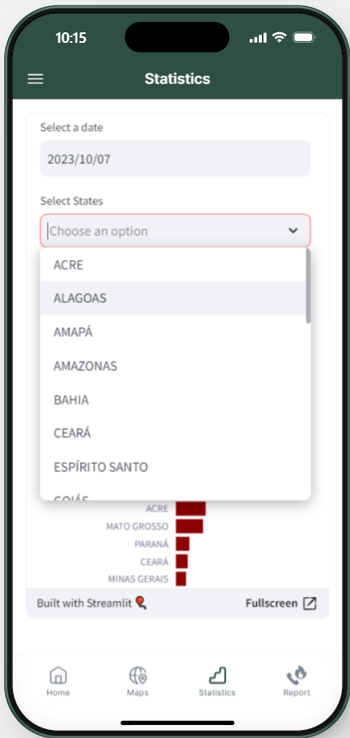
    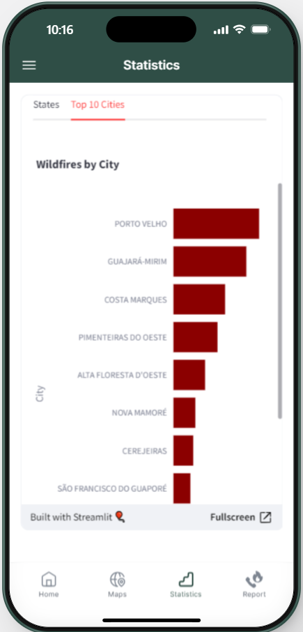
    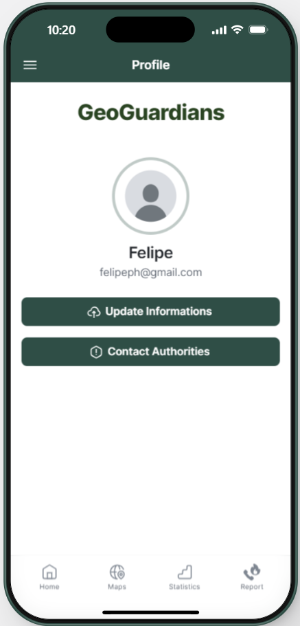
    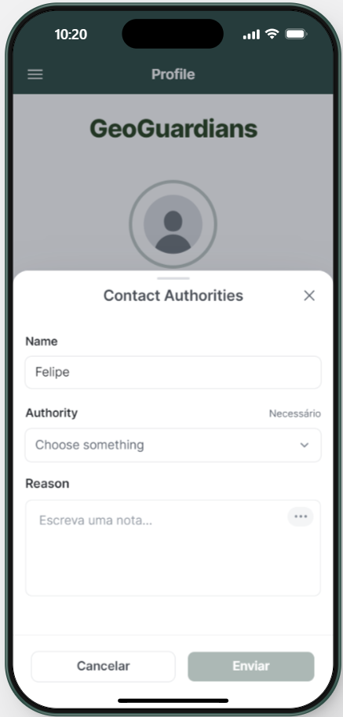
    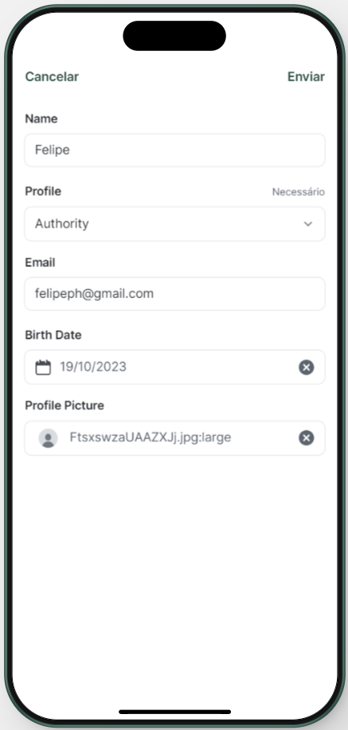
    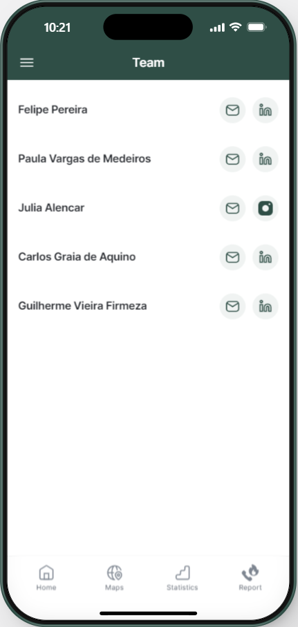

## About the Team
It's getting more and more frequent to hear about wildfires in the world. Brazil is one of the leaders in wildfires incidents worldwide, especially in the region of the Amazon rainforest and in the Cerrado biome. Most of our team members have already heard about incidents nearby and never knew exactly what to do or what's being done about it.

That inspired us into creating an application to better understand and solve this huge problem. We built an app that gathered information from satellites and people’s reports resulting on interactive map with location and statistics of fires.

Where citizens are able to see the fires happening around the world and also report the ones that they are witnessing.

Besides the civilian functions farmers also have their own type of account enabling them to order thermal cameras monitored by an AI that will alert them when a wild fire is starting in their propriety.

All the fire stations are able to register in our platform and receive alerts when they are the closest to a fire that at least three people reported or when a satellite picks up on one.

We’re ready to change the world. Are you ready to do it with us?

## Use of Artificial Intelligence
We have used the site Ideogram for ilustrating the app and team's logo and https://firefly.adobe.com to get AI generated images to use as examples inside the app.

## Space Agency Data
DataINPE - https://dataserver-coids.inpe.br/queimadas/queimadas/

NASAEarthData - https://worldview.earthdata.nasa.gov/

ESAViewer - https://s3wfa.esa.int/viewer

## References

INPE - https://dataserver-coids.inpe.br/queimadas/queimadas/

NASAEarthData - https://worldview.earthdata.nasa.gov/

ESAViewer - https://s3wfa.esa.int/viewer

INMET - https://portal.inmet.gov.br/dadoshistoricos

PanoramaSIPAM - https://panorama.sipam.gov.br/painel-do-fogo/

GlideApps - https://www.glideapps.com/

Canva - http://www.canva.com/

Capcut - https://www.capcut.com/

ImagePexels_AuthorPixabay - https://www.pexels.com/pt-br/foto/
floresta-em-chamas-51951/

VideoPexels_AuthorArnavKainthola - https://www.pexels.com/video/wildfire-on-the-mountain-7543653/

AdobeFirefly - https://firefly.adobe.com/

Figma - https://www.figma.com

Miro - https://miro.com/

## Team Contact Information
Felipe Pereira

E-mail: felipeph@gmail.com

LinkedIn: https://www.linkedin.com/in/felipeph/

Paula Vargas

E-mail: paulavargas-sm@hotmail.com

LinkedIn: https://www.linkedin.com/in/pmvargas/

Julia Alencar

E-mail: julia.alencar@ufu.br

Instagram: https://www.instagram.com/juliagabi_

Carlos Aquino

E-mail: carlosgraiaaquino@outlook.com

LinkedIn: https://www.linkedin.com/in/carlosgraiaaquino/

Guilherme Firmeza
E-mail: gvfirmeza@gmail.com
LinkedIn: https://www.linkedin.com/in/guilherme-firmeza/